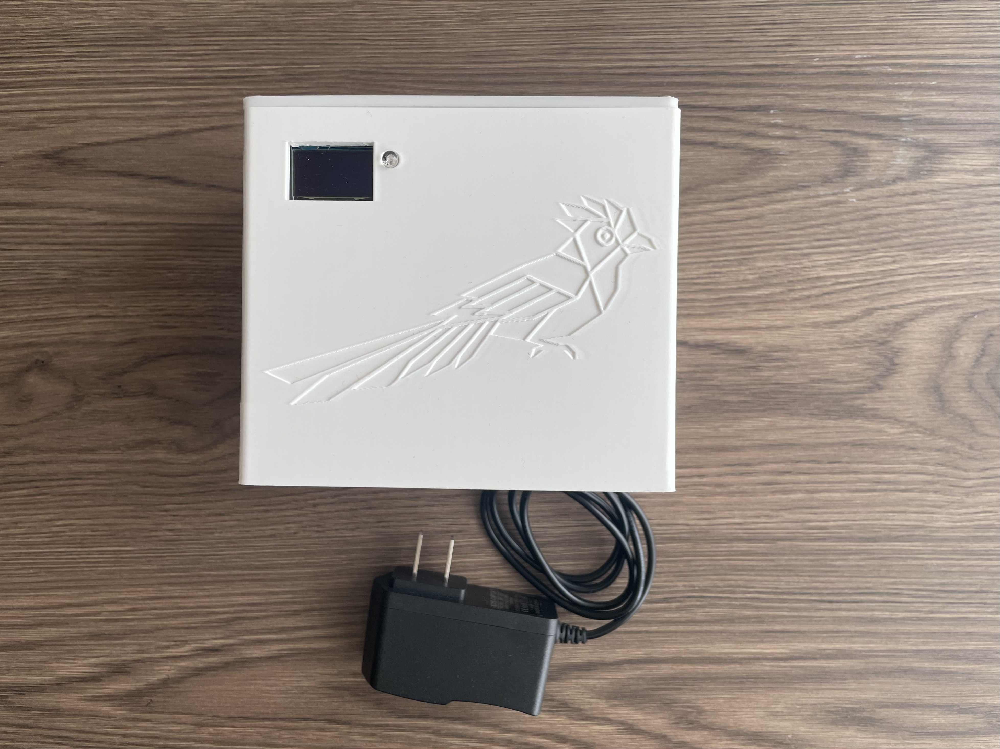
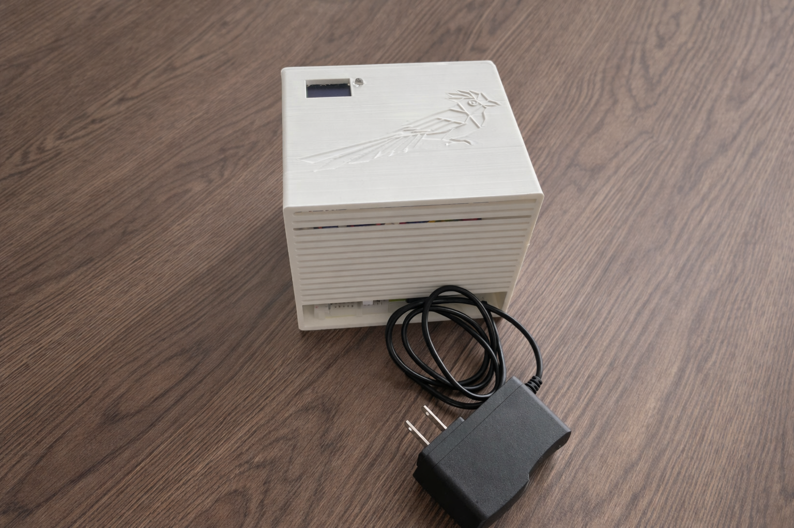

# 🌍 Nodo IoT - Monitoreo de Calidad del Aire (Sabana Centro)

Bienvenido al repositorio oficial del prototipo de monitoreo ambiental desarrollado para la región de Sabana Centro (Cundinamarca). 

Este proyecto implementa un sistema embebido de bajo costo basado en un ESP32 capaz de medir, analizar y fusionar en tiempo real la concentración de gases contaminantes, material particulado y variables meteorológicas, generando alertas tempranas *in situ* sin necesidad de conexión a internet.

  

### Tecnologías y Hardware Principal
* **Microcontrolador:** ESP32 (Programado en C++ / PlatformIO)
* **Sensores Ambientales:** MQ-135 (Gases/VOCs), HW-870 (Mock PM), BMP280 (Presión/Temp), DHT22 (Humedad).
* **Interfaz:** Pantalla OLED SSD1306 y Matriz LED RGB de semaforización basada en normativas OSHA.

  

---

## 📖 Documentación Completa (Wiki)

Este archivo es solo la presentación del repositorio. **Toda la documentación técnica de ingeniería, diagramas, esquemáticos, análisis de resultados y el video de validación se encuentran en nuestra Wiki.**

👉 **[HAZ CLIC AQUÍ PARA IR A LA WIKI DEL PROYECTO](INGRESA_AQUI_EL_LINK_DE_TU_WIKI)** 👈

---

### 👨‍💻 Equipo de Desarrollo
* **Juan David Cruz Angel** (@Firewallrbn) - Hardware, Arquitectura Estructural y Simulación.
* **Julián David Aguilar Zambrano** - Integración de Sensores e Investigación Hardware.
* **Alejandro Parra Galvis** - Project Management y Soporte de Hardware.

*Desarrollado para el reto de Diseño e Implementación IoT - 2026*
