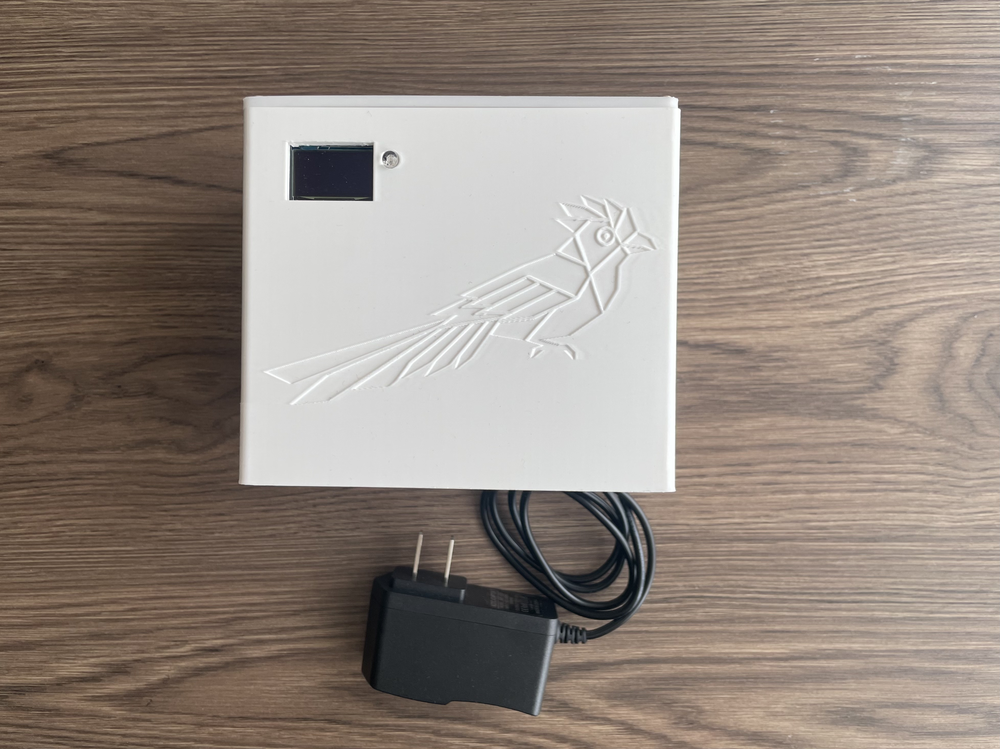
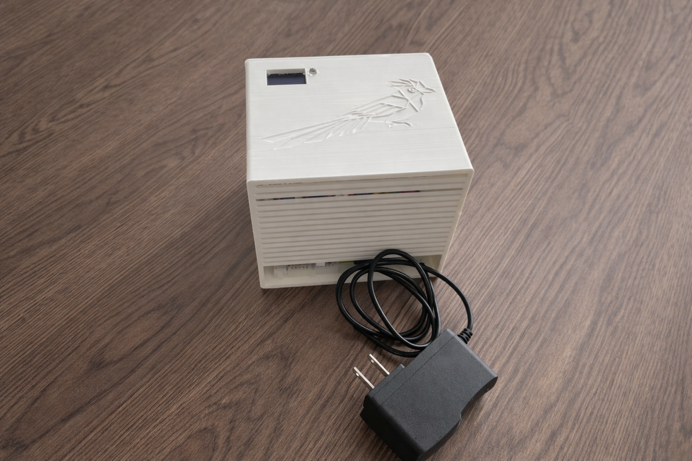

# Nodo Quetzal - Monitoreo de Calidad del Aire (Sabana Centro)

> **Sistema IoT de monitoreo ambiental de tres capas (Edge → Gateway → Cloud) desarrollado para la subregión de Sabana Centro, Colombia (aprox. 2.560 msnm).**

Este repositorio aloja el código fuente y la arquitectura completa de un sistema IoT que mide, almacena, analiza y visualiza en tiempo real la calidad del aire. El sistema combina un **Nodo Edge** (ESP32) con sensores ambientales, un **Gateway IoT** (Raspberry Pi 5) con base de datos SQLite y módulo de IA, y un **Dashboard Global** (Ubidots) accesible desde cualquier parte de Colombia — todo comunicado de extremo a extremo mediante el protocolo **MQTT**.

 <!-- REFERENCIAS A IMAGENES DEL REPOSITORIO DE CÓDIGO (NO ELIMINAR) -->

 

 

 

## Características Principales

* ** Procesamiento Edge Autónomo:** Basado en un microcontrolador ESP32 programado de manera nativa en C++ y gestionado usando PlatformIO. Incorpora algoritmos matemáticos como la compensación de temperatura y humedad κ-Köhler en el PMS5003 y un motor de reglas de fusión de datos de 5 matrices.

* ** Semaforización Normativa:** Lógica estricta de alertas basada en los límites de exposición permisibles de **OSHA y NIOSH**, alineados con la Resolución 2254 de 2017 del MinAmbiente y las Guías OMS 2021. Incluye notificación *in situ* con Matriz LED RGB y Buzzer.

* ** Doble Dashboard (Local + Global):** Servidor web embebido en el ESP32 para acceso local (WLAN), y Dashboard en Ubidots accesible desde cualquier navegador conectado a internet en Colombia.

* ** Comunicación MQTT End-to-End:** Protocolo MQTT asíncrono desde el ESP32 hasta Ubidots, pasando por un broker Mosquitto local en la Raspberry Pi. Elimina la latencia de HTTP y permite suscripciones bidireccionales.

* ** Persistencia Local Anti-Pérdidas:** Base de datos SQLite en la Raspberry Pi que almacena **todo** registro antes de enviarlo a la nube. Si se cae el internet, los datos quedan a salvo localmente.

* ** Inteligencia Artificial Integrada (Gemini 2.0 Flash):** Módulo autónomo que analiza las últimas lecturas y genera diagnósticos ambientales contextualizados. Se activa automáticamente cada 20 lecturas o manualmente desde el dashboard de Ubidots.

* ** Seguridad RBAC:** Control de Acceso Basado en Roles. El administrador genera URLs seguras de solo lectura para las autoridades (Rector, Alcaldía, CAR). Las credenciales sensibles residen exclusivamente en la Raspberry Pi.

* ** Tolerancia a Fallos Multicapa:** Reconexión automática en ESP32 (lógica `millis()` no bloqueante) y en el Gateway Python (`try-except` infinitos con reintentos cada 5 segundos). El sistema nunca se congela.

## Arquitectura de Hardware y Sensores

La solución integra múltiples niveles de detección, asegurando que la evaluación de la calidad del aire sea completa:

| Componente | Función Principal |
| :--- | :--- |
| **ESP32** | Cerebro de procesamiento Edge: bus I2C, ADC, UART, FreeRTOS dual-core, servidor web, cliente MQTT. |
| **Raspberry Pi 5** | Gateway IoT: Mosquitto broker, base de datos SQLite, puente MQTT a Ubidots, módulo de IA Gemini. |
| **PMS5003** | Sensor láser de dispersión para medición de material particulado PM2.5 atmosférico. |
| **MQ-135** | Detección de Gases nocivos y CO2. Calibración logarítmica ajustada dinámicamente. |
| **BMP280** | Medición de precisión barométrica, cambios de presión y altitud (Sabana Centro ~750 hPa). |
| **DHT22** | Muestreo en tiempo real de temperatura ambiental y humedad relativa. |
| **OLED SSD1306** | Display de interacción con el usuario final de 128x64 píxeles. |
| **LED RGB + Buzzer** | Actuadores de señalización de alertas directas y de rápida visualización a distancia. |

## Stack Tecnológico

| Capa | Tecnología | Lenguaje |
|---|---|---|
| **Firmware ESP32** | PlatformIO + Arduino Framework | C++ |
| **Gateway IoT** | Python 3 + paho-mqtt + SQLite | Python |
| **Broker MQTT** | Eclipse Mosquitto | — |
| **Cloud IoT** | Ubidots (MQTT + Dashboard) | — |
| **Inteligencia Artificial** | Google Gemini 2.0 Flash (API REST) | Python |
| **Base de Datos** | SQLite 3 (`historial_aire.db`) | SQL |

## Documentación Rigurosa (Wiki)

Debido a la magnitud de diseño, calibración, justificación de impacto en la zona de Sabana Centro, esquemáticos y validación metódica, **este repositorio cuenta con una extensa documentación ubicada en su WIKI oficial**.

Los invitamos profundamente a explorar cada una de las páginas, donde se hace desglose nivel experto del prototipo:

1. **[Resumen, Motivación y Solución Propuesta](https://github.com/Firewallrbn/IoT-AirQuality-SabanaCentro/wiki/1.-Resumen-General,-Motivación-y-Justificación)**: El encuadre del problema real en Cundinamarca y nuestro factor diferencial.

2. **[Arquitectura, Umbrales y Lógica de Fusión](https://github.com/Firewallrbn/IoT-AirQuality-SabanaCentro/wiki/2.-Solución-Propuesta)**: Diagramas UML, semaforización y motor de reglas multicapa.

3. **[Esquemáticos y Guía de Montaje Físico](https://github.com/Firewallrbn/IoT-AirQuality-SabanaCentro/wiki/2.5.-Montaje-Físico-y-Guía-de-Replicabilidad)**: Circuitería, esquemáticos CAD, y control de potencia.

4. **[Código Fuente del ESP32 Explicado](https://github.com/Firewallrbn/IoT-AirQuality-SabanaCentro/wiki/3.-Código-Fuente-Explicado)**: Walkthrough bloque por bloque del firmware con MQTT, FreeRTOS y servidor web.

5. **[Gateway IoT — Raspberry Pi](https://github.com/Firewallrbn/IoT-AirQuality-SabanaCentro/wiki/3.5.-Gateway-IoT-y-Código-del-Gateway-(Raspberry-Pi))**: Documentación completa del `gateway.py`: SQLite, doble cliente MQTT, módulo de IA Gemini.

6. **[Plataforma Cloud, Dashboard y Seguridad](https://github.com/Firewallrbn/IoT-AirQuality-SabanaCentro/wiki/4.5.-Plataforma-Cloud,-Dashboard-Global-y-Seguridad)**: Ubidots, acceso RBAC y cobertura local+global.

7. **[Resultados de Experimentación y Autoevaluación](https://github.com/Firewallrbn/IoT-AirQuality-SabanaCentro/wiki/5.-Configuración-Experimental,-Resultados-y-Análisis)**: Gráficas de medición, inyección de errores y análisis.

8. **[Protocolos de Uso, Replicabilidad y Video](https://github.com/Firewallrbn/IoT-AirQuality-SabanaCentro/wiki/7.-Protocolo-de-Replicabilidad)**: Instructivo completo para replicar el sistema de tres capas.

👉 **[HAZ CLIC AQUÍ PARA ACCEDER A LA WIKI DEL PROYECTO ACTUALIZADA](https://github.com/Firewallrbn/IoT-AirQuality-SabanaCentro/wiki)** 👈

---

## Equipo de Desarrollo e Investigación

Este prototipo hardware/software fue orquestado y creado por:

* **Juan David Cruz Angel** (@Firewallrbn) - Liderazgo de Hardware, Arquitectura Edge-to-Cloud, Firmware C++, Gateway Python e Integración IA.

* **Julián David Aguilar Zambrano** - Análisis de Integración, Investigación Científica y Pruebas Iniciales.

* **Alejandro Parra Galvis** - Project Management, Soporte de Visualizaciones y Documentación Estratégica.

  

 <i>Diseñado y ejecutado para el reto de Ingeniería IoT Avanzada — Universidad de la Sabana, 2026-1.</i>

